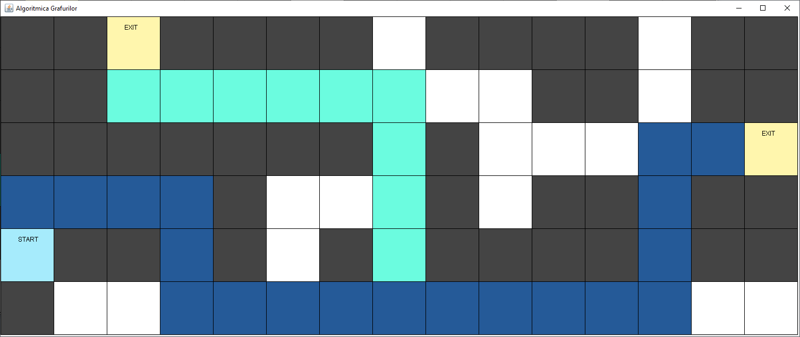

# Maze
An application in that we can see how bfs algorithm works. 
Java swing is used for the GUI part.

# Example
## Data input 
The maze is generated based on a .txt file, that contains the following numbers:
- 0 for a blocked path
- 1 for a free path
- 2 is the end point (can be multiple exits)
- 3 is the start point (only one enter point)

At this point the input data must have the size of the maze too.

## Output
Lets take this input data:     
0 0 2 0 0 0 0 1 0 0 0 0 1 0 0  
0 0 1 1 1 1 1 1 1 1 0 0 1 0 0  
0 0 0 0 0 0 0 1 0 1 1 1 1 1 2  
1 1 1 1 0 1 1 1 0 1 0 0 1 0 0  
3 0 0 1 0 1 0 1 0 0 0 0 1 0 0  
0 1 1 1 1 1 1 1 1 1 1 1 1 1 1  
 

The output will be:

